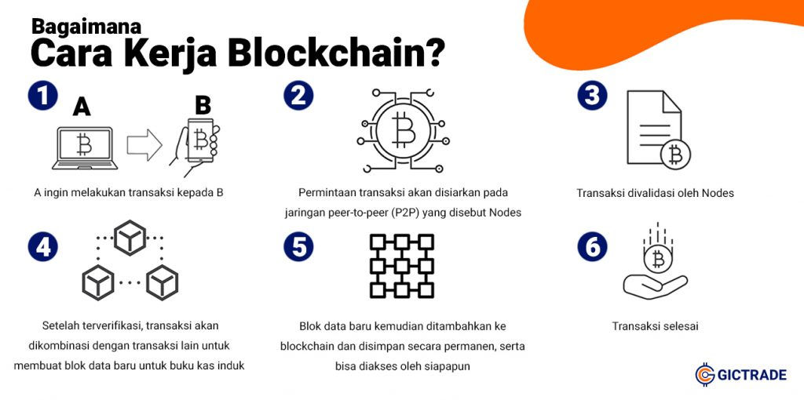

# BLOCKCHAIN

## Apa itu Blockchain?

Blockchain adalah database terdistribusi atau buku besar yang dibagikan di antara node jaringan komputer. Mereka terkenal karena peran penting mereka dalam sistem mata uang kripto untuk menjaga catatan transaksi yang aman dan terdesentralisasi, namun mereka tidak terbatas pada penggunaan mata uang kripto. Blockchain dapat digunakan untuk membuat data di industri mana pun tidak dapat diubah—istilah yang digunakan untuk menggambarkan ketidakmampuan untuk diubah. Berbagai jenis informasi dapat disimpan di blockchain, namun penggunaan transaksi yang paling umum adalah sebagai buku besar. Dalam kasus Bitcoin, blockchain bersifat terdesentralisasi, sehingga tidak ada satu orang atau kelompok pun yang memiliki kendali—sebaliknya, semua pengguna secara kolektif tetap memegang kendali. Blockchain yang terdesentralisasi tidak dapat diubah, artinya data yang dimasukkan tidak dapat diubah. Untuk Bitcoin, transaksi dicatat secara permanen dan dapat dilihat oleh siapa saja.

<details>

**<summary> Detail Penjelasan </summary>**

### Desentralisasi :

- Tidak Ada Otoritas Pusat : Dalam sistem tradisional seperti bank, ada otoritas pusat yang mengelola dan memverifikasi semua transaksi. Dalam blockchain, semua peserta (node) dalam jaringan memiliki salinan yang sama dari seluruh blockchain. Tidak ada satu entitas yang memiliki kendali penuh.
- Salinan Data yang Sama : Setiap node dalam jaringan blockchain menyimpan salinan lengkap dari seluruh rantai blok. Ini berarti bahwa setiap node memiliki semua informasi yang sama, yang membuat sistem lebih tahan terhadap kegagalan dan serangan

### Struktur Blok dan Rantai :

1. Blok (Block): Data transaksi dikumpulkan ke dalam blok. Setiap blok terdiri dari beberapa elemen penting :

- Data Transaksi: Informasi mengenai transaksi yang terjadi, misalnya siapa yang mengirim apa kepada siapa.
- Hash Blok: Sebuah fingerprint digital unik dari blok tersebut yang dihasilkan menggunakan algoritma kriptografi.
- Hash Blok Sebelumnya: Fingerprint digital dari blok sebelumnya dalam rantai, yang menghubungkan blok satu dengan yang lainnya.

2. Rantai (Chain): Blok-blok ini dihubungkan secara berurutan dari awal hingga blok terbaru, membentuk sebuah rantai. Karena setiap blok berisi hash dari blok sebelumnya, ini menciptakan sebuah urutan kronologis yang sulit diubah.

### Keamanan/Security

1. Kriptografi: Blockchain menggunakan kriptografi untuk mengamankan, integritas, dan autentikasi data. Ada beberapa komponen kriptografi penting dalam blockchain, salah satunya adalah hashing.

- Hashing adalah proses di mana input data dari berbagai ukuran panjang data diubah menjadi output tetap dengan panjang tertentu. Algoritma hashing mengambil input data (disebut juga sebagai pesan) dan menghasilkan output yang disebut hash atau digest. Hash ini adalah representasi unik dari input data tersebut.

* Sifat-sifat Hashing :

```
- Deterministik: Input yang sama akan selalu menghasilkan hash yang sama.
- Cepat: Proses menghasilkan hash dari input sangat cepat.
- Output Tetap: Panjang hash selalu sama, tidak peduli seberapa besar atau kecil inputnya.
  Misalnya, SHA-256 menghasilkan hash sepanjang 256 bit.
- Pra-gambar Resisten: Sulit untuk menemukan input yang sesuai dengan hash tertentu.
- Tahan Tabrakan: Sulit untuk menemukan dua input berbeda yang menghasilkan hash yang sama.
- Avalanche Effect: Perubahan kecil pada input menghasilkan perubahan besar pada hash.
```

- Penggunaan Hashing dalam Blockchain

1.  Menghubungkan Blok :

```
- Setiap blok dalam blockchain berisi hash dari blok sebelumnya.
  Ini menciptakan koneksi berantai antara blok-blok tersebut, membentuk rantai (chain).
- Jika data dalam satu blok diubah, hash dari blok itu juga berubah. Karena setiap blok berisi hash dari blok sebelumnya,
  perubahan pada satu blok akan memutus rantai hash, membuat perubahan tersebut mudah terdeteksi.
```

2.  Mengamankan Data Transaksi :

```
- Setiap transaksi dalam blok juga dapat di-hash untuk menghasilkan hash transaksi.
- Semua hash transaksi dalam satu blok kemudian digabungkan menggunakan struktur yang disebut Merkle Tree.
  Hash root dari Merkle Tree ini dimasukkan dalam header blok.
```

3.  Proses Mining/Penambangan :

```
- Dalam mekanisme Proof of Work (PoW), miners bersaing untuk menemukan nonce (angka yang digunakan sekali) yang,
  bila digabungkan dengan data blok lainnya, menghasilkan hash yang memenuhi kondisi tertentu (misalnya, dimulai dengan sejumlah nol tertentu).
- Proses ini memerlukan banyak upaya dan daya komputasi, dan sulit untuk dihasilkan ulang tanpa melakukan pekerjaan yang sama.
```

- Contoh Hashing dalam Blockchain untuk menghubungkan blok :

1. Blok Pertama (Blok Genesis)

```
- Data: "Transaksi A"
- Hash dari Blok: SHA-256("Transaksi A") = 1111
```

2. Blok Kedua :

```
- Data: "Transaksi B"
- Hash dari Blok Sebelumnya: 1111
- Kombinasi Data: "Transaksi B" + 1111
- Hash dari Blok: SHA-256("Transaksi B" + 1111) = 2222
```

3. Blok Ketiga:

```
- Data: "Transaksi C"
- Hash dari Blok Sebelumnya: 2222
- Kombinasi Data: "Transaksi C" + 2222
- Hash dari Blok: SHA-256("Transaksi C" + 2222) = 3333
```

Jika seseorang mencoba mengubah data dalam blok kedua dari "Transaksi B" menjadi "Transaksi X", hash dari blok kedua akan berubah. Ini menyebabkan hash dari blok ketiga menjadi tidak valid, dan semua blok berikutnya juga akan menjadi tidak valid. Untuk memperbaiki rantai, peretas harus menghitung ulang semua hash dari blok yang terpengaruh, yang memerlukan waktu dan sumber daya yang sangat besar.

4.  Keamanan Tambahan dari Kriptografi

    - Tanda Tangan Digital: Setiap transaksi di blockchain ditandatangani secara digital oleh pengirim menggunakan kunci privat mereka. Node lain dapat memverifikasi tanda tangan ini dengan kunci publik pengirim.
    - Enkripsi: Meskipun data transaksi biasanya transparan, beberapa blockchain menggunakan enkripsi untuk menyembunyikan informasi sensitif.

Dengan cara ini, kriptografi dan hashing memastikan bahwa blockchain tetap aman, transparan, dan tidak dapat diubah.

5.  Immutability: Sekali data ditambahkan ke blockchain, sangat sulit untuk mengubahnya. Untuk mengubah data dalam satu blok, hash dari blok itu dan semua blok berikutnya harus diubah, yang memerlukan persetujuan mayoritas dari node dalam jaringan.

### Konsensus

Konsensus dalam konteks blockchain adalah mekanisme yang digunakan untuk mencapai kesepakatan di antara node-node dalam jaringan terdistribusi tentang keadaan data (seperti transaksi) yang valid dan harus ditambahkan ke blockchain. Karena tidak ada otoritas pusat yang mengendalikan jaringan, mekanisme konsensus memastikan bahwa semua peserta setuju pada satu versi kebenaran, yaitu blockchain yang sah dan konsisten.

1.  Mekanisme Konsensus Umum

- Proof of Work (PoW) :

```
-Cara Kerja : Miners bersaing untuk memecahkan teka-teki kriptografi yang kompleks dengan mencoba banyak kombinasi sampai menemukan solusi yang valid.
              Proses ini membutuhkan banyak daya komputasi.
-Keuntungan : Sangat aman karena membutuhkan banyak usaha dan sumber daya untuk menghasilkan blok baru.
-Kerugian   : Konsumsi energi yang tinggi dan skalabilitas rendah.
-Contoh     : Digunakan oleh Bitcoin.
```

2.  Proof of Stake (PoS) :

```
- Cara Kerja : Validator dipilih untuk membuat blok baru berdasarkan jumlah cryptocurrency yang mereka "taruh" (stake) sebagai jaminan.
               Semakin besar stake, semakin besar kemungkinan dipilih.
- Keuntungan : Konsumsi energi lebih rendah dan lebih efisien dibandingkan PoW.
- Kerugian   : Potensi sentralisasi karena validator dengan stake besar memiliki lebih banyak kekuasaan.
- Contoh     : Digunakan oleh Ethereum 2.0.
```

3.  Delegated Proof of Stake (DPoS) :

```
- Cara Kerja : Pemegang token memilih sejumlah kecil delegasi yang akan memvalidasi transaksi dan membuat blok baru atas nama mereka.
- Keuntungan : Cepat dan efisien dalam memproses transaksi.
- Kerugian   : Potensi sentralisasi karena kekuasaan terpusat pada sedikit delegasi.
 Contoh      : Digunakan oleh EOS.
```

2.  Fungsi dan Tujuan Konsensus
    - Keamanan : Melindungi jaringan dari serangan dan memastikan bahwa hanya transaksi yang valid yang ditambahkan ke blockchain.
    - Transparansi : Semua node memiliki akses ke salinan yang sama dari blockchain, sehingga tidak ada satu pihak yang dapat memanipulasi data.
    - Keandalan : Sistem dapat terus berfungsi meskipun beberapa node mengalami kegagalan atau berperilaku tidak jujur.
    - Desentralisasi : Menghindari ketergantungan pada satu otoritas pusat, memungkinkan kontrol yang lebih merata di antara peserta jaringan.

Dengan mekanisme konsensus, blockchain dapat menjaga integritas dan keamanannya dalam lingkungan yang terdesentralisasi dan tanpa kepercayaan (trustless).

### Transparansi dan Anonimitas

- Transparansi : Setiap transaksi yang pernah terjadi di blockchain dapat dilihat oleh semua node dalam jaringan. Ini memberikan tingkat transparansi yang tinggi, yang sangat berbeda dari sistem tradisional.
- Anonimitas : Meskipun semua transaksi dapat dilihat, identitas pengguna seringkali disembunyikan di balik alamat kriptografi. Ini memberikan privasi bagi pengguna sambil tetap memungkinkan verifikasi transaksi.

### Smart Contracts

- Smart Contracts: Program yang berjalan di blockchain dan dieksekusi secara otomatis ketika kondisi tertentu terpenuhi. Mereka memungkinkan otomatisasi dan pengurangan biaya transaksi. Contohnya :
  - Automatisasi Pembayaran: Sebuah smart contract dapat memastikan bahwa pembayaran dilakukan secara otomatis ketika barang dikirim.
  - Desentralisasi Aplikasi (DApps): Aplikasi yang berjalan di blockchain tanpa memerlukan server pusat.

</details>

## Alur Kerja Blockchain



- Analogi Sederhanya :
  Contoh sederhana yaitu saat terjadi transaksi peminjaman bola antara Anton dan Budi. Anton, yang memiliki 3 bola memberi pinjaman 2 bola kepada Budi. Anton mencatat 2 bola yang dipinjam Budi untuk mengingatnya. Dalam sistem konvensional, Budi bisa mengelak telah menerima 2 bola dari Anton. Alasannya tentu karena hanya Anton yang punya catatan mengenai 2 bola yang dipinjam Budi. Budi dan teman yang lain, tidak memiliki catatan tersebut. Namun, dengan menggunakan sistem blockchain, ketika Anton akan meminjamkan 2 bola pada Budi, seketika itu juga kabar transaksi tersebut disebarkan, selain diterima oleh Anton dan Budi, kabar juga diterima oleh kawan mereka yang lain. Anton, Budi, dan teman-teman lainnya memvalidasi transaksi tersebut. Jika semua menyatakan transaksi benar terjadi, pinjaman 2 bola itu lalu dicatat. Pencatatan tidak hanya di buku milik Anton, tapi juga buku milik Budi, dan juga buku teman-teman lainnya. Untuk melindunginya dari kecurangan, catatan tersebut diproteksi dengan sampul dan masing-masing pemilik tidak bisa menghapus catatan.

## Aplikasi Blockchain

Blockchain tidak hanya digunakan untuk cryptocurrency seperti Bitcoin dan Ethereum. Teknologi ini telah meluas ke berbagai sektor, termasuk:

- Logistik: Melacak pengiriman barang secara transparan dan aman.
- Kesehatan: Menyimpan catatan medis yang tidak dapat diubah dan dapat diakses oleh semua penyedia layanan kesehatan yang sah.
- Perbankan: Memfasilitasi transaksi internasional yang cepat dan murah tanpa memerlukan perantara.
- Hak Kekayaan Intelektual: Melacak kepemilikan dan distribusi karya digital.

## Kelebihan dan Kekurangan

1. Kelebihan :

- Keamanan Tinggi: Data yang tersimpan di blockchain sulit untuk diubah atau dihapus.
- Transparansi: Semua transaksi dapat dilihat oleh semua peserta.
- Desentralisasi: Tidak ada satu titik kegagalan.

2. Kekurangan :

- Skalabilitas: Blockchain bisa menjadi lambat dan mahal seiring dengan bertambahnya transaksi.
- Kompleksitas: Implementasi dan pemahaman teknologi ini memerlukan pengetahuan yang mendalam.
- Regulasi: Masih ada banyak ketidakpastian hukum di berbagai negara mengenai penggunaan blockchain dan cryptocurrency.
