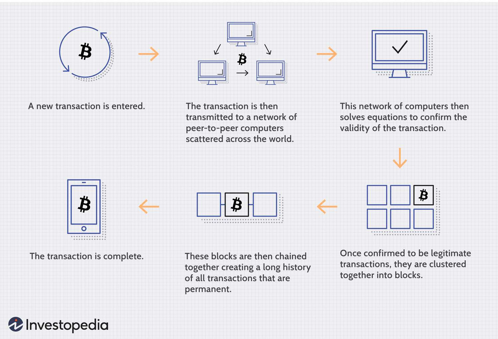

# BLOCKCHAIN

## Apa itu Blockchain?

  Blockchain adalah database terdistribusi atau buku besar yang dibagikan di antara node jaringan komputer. Mereka terkenal karena peran penting mereka dalam sistem mata uang kripto untuk menjaga catatan transaksi yang aman dan terdesentralisasi, namun mereka tidak terbatas pada penggunaan mata uang kripto. Blockchain dapat digunakan untuk membuat data di industri mana pun tidak dapat diubah—istilah yang digunakan untuk menggambarkan ketidakmampuan untuk diubah. Berbagai jenis informasi dapat disimpan di blockchain, namun penggunaan transaksi yang paling umum adalah sebagai buku besar. Dalam kasus Bitcoin, blockchain bersifat terdesentralisasi, sehingga tidak ada satu orang atau kelompok pun yang memiliki kendali—sebaliknya, semua pengguna secara kolektif tetap memegang kendali. Blockchain yang terdesentralisasi tidak dapat diubah, artinya data yang dimasukkan tidak dapat diubah. Untuk Bitcoin, transaksi dicatat secara permanen dan dapat dilihat oleh siapa saja.

  - Desentralisasi :
    * Tidak Ada Otoritas Pusat : Dalam sistem tradisional seperti bank, ada otoritas pusat yang mengelola dan memverifikasi semua transaksi. Dalam blockchain, semua peserta (node) dalam jaringan memiliki salinan yang sama dari seluruh blockchain. Tidak ada satu entitas yang memiliki kendali penuh.
    * Salinan Data yang Sama : Setiap node dalam jaringan blockchain menyimpan salinan lengkap dari seluruh rantai blok. Ini berarti bahwa setiap node memiliki semua informasi yang sama, yang membuat sistem lebih tahan terhadap kegagalan dan serangan
  
  - Struktur Blok dan Rantai :
    * Blok (Block): Data transaksi dikumpulkan ke dalam blok. Setiap blok terdiri dari beberapa elemen penting :
     * Data Transaksi: Informasi mengenai transaksi yang terjadi, misalnya siapa yang mengirim apa kepada siapa.
     * Hash Blok: Sebuah fingerprint digital unik dari blok tersebut yang dihasilkan menggunakan algoritma kriptografi.
     * Hash Blok Sebelumnya: Fingerprint digital dari blok sebelumnya dalam rantai, yang menghubungkan blok satu dengan yang lainnya.

## Proses Transaksi

  
Pada [sequelize](https://sequelize.org/) terdapat 2 cara untuk membuat model, yaitu menggunakan :
 - [`sequelize.define()`](https://sequelize.org/api/v6/class/src/sequelize.js~sequelize#instance-method-define)
 - [`extend class Model{}`](https://sequelize.org/api/v6/class/src/model.js~model#static-method-init)

## Membuat Model(sequelize.define())
Untuk membuat sebuah Model dengan menggunakan method `define()` milik obejct sequelize caranya sangatlah mudah, kita hanya perlu membuat object sequelize connection setelah itu kita bisa panggil method `define()` yang menerima 2 parameter yaitu nama model dan object dari fields
``` js
const DB_USERNAME = process.env.DB_USERNAME;
const DB_PASSWORD = process.env.DB_PASSWORD;
const DB_DIALECT = process.env.DB_DIALECT;
const DB_NAME = process.env.DB_NAME;
const DB_HOST = process.env.DB_HOST;
const DB_PORT = process.env.DB_PORT;

const connection = new Sequelize(DB_NAME, DB_USERNAME, DB_PASSWORD, {
    host: DB_HOST,
    port: DB_PORT,
    dialect: DB_DIALECT,
});

// membuat model person
const person = connection.define("person", {
    // nama field
    firstName:{
        // constraint
        type: DataTypes.STRING,
        allowNull: false
    },
    lastName: {
        type: DataTypes.STRING,
        allowNull: true
    }
});
```
## Membuat Model(exteds class Model)
Cara kedua untuk membuat model yaitu dengan membuat class yang meng extends object [Model](https://sequelize.org/api/v6/class/src/model.js~model), setelah itu kita bisa memanggil method init milik class Model yang menerima 2 argument yaitu :
 - object attribute/field
 - option
``` js
import { DataTypes, Model } from "sequelize";
import connection from "../db/config/connection.js"
export default class Users extends Model{};
Users.init({
    id: {
        type: DataTypes.INTEGER,
        primaryKey: true,
        autoIncrement: true
    },
    firstName: {
        type: DataTypes.STRING(100),
        allowNull: false,
    },
    lastName: {
        allowNull: true,
        type: DataTypes.STRING(100)
    },
    password: {
        type: DataTypes.STRING(255),
        allowNull: false
    }
},{
    sequelize: connection,
    tableName: "users",
    underscored: true
});
```
## Syncronization
Kita telah mengetahui bahwa model merupakan representasi dari sebuah tabel di database, mungkin dibenah kalian muncul apakah bisa sebuah model di mappingkan menajadi tabel didalam database secara otomatis tampa kita bersentuhan denga command SQL???  
  
Jawabanya "BISA.....:V"  
  
Object dari `sequelize` memiliki sebuah method `sync(option)` yang digunakan untuk melakukan syncronization antara tabel dan model.  
  
method `sync()` memiliki 2 option yang dapat kita gunakan :
| Option | value    | description
|--------|----------|-----------
|force   |true      | jika tabel sudah dibuat maka tabel akan dihapus terkebih dahulu setelah itu dibuat kembali
|alter   |true      | Jika struktur tabel yang merepresentasikan sebuah model terdapat perubahan maka sequelize akan melakukan altertabel dan menyamakan tabel yang ada pada database dengan model yang telah kita devinisikan

``` js
import Users from "./UsersModel.js";
import connection from "../db/config/connection.js";
async function sync() {
    try{
        await connection.sync({
            alter: true
        });
        console.log("Database successfuly sync...");
    }catch(err) {
        console.log("Database failed sync...");
        console.log(err);
    }
}
sync();
export { Users, connection }
```
# Sequelize Associations
Sequelize orm mendukung standard dari associations(one-to-one, one-to-many, many-to-many)
Untuk implementasi dari associations pada sequelize terdapat 2 cara :
 - menggunakan method yang disediakan sequelize
 - membuat associations secara manual

## Membuuat Associations secara manual
Untuk membuat associations secara manual kita bisa melakukanya secara langsung pada saat kita mendefinisikan sebuah model dengan cara menambahkan sebuah kolom foreign key 

## One-to-one relationsip
One-to-one relationsip adalah sebuah relasi satu data hanya boleh dimiliki oleh satu data pada tabel lain.  
Untuk membuat relasi tersebut kita dapat mendefinisikan sebuah foreignkey pada salsatu model dan foreignkey tersebut kita set menjadi unique.

Contohnya relasi antara Users dengan Addresses yang mana 1 user hanya boleh memiliki 1 data addersses.
``` js
import { DataTypes, Model } from "sequelize";
import connection from "../db/config/connection.js"
export default class Users extends Model{};
Users.init({
    id: {
        type: DataTypes.INTEGER,
        primaryKey: true,
        autoIncrement: true
    },
    firstName: {
        type: DataTypes.STRING(100),
        allowNull: false,
    },
    lastName: {
        allowNull: true,
        type: DataTypes.STRING(100)
    },
    password: {
        type: DataTypes.STRING(255),
        allowNull: false
    }
},{
    sequelize: connection,
    tableName: "users",
    underscored: true
});

export default class Addresses extends Model{};
Addresses.init({
    id: {
        type: DataTypes.INTEGER,
        autoIncrement: true,
        primaryKey: true,
        unique: true,
        allowNull: false,
    },
    // menambahkan foreignkey user_id pada model Addresses
    user_id: {
        type: DataTypes.INTEGER,
        unique: true,
        references: {
            // Mosel Reference
            model: Users,
            // kolom model Users yang digunakan sebagai foreignkey
            key: "id"
        }
    },
    country: {
        type: DataTypes.STRING(100),
        allowNull: false
    },
    province: {
        allowNull: true,
        type: DataTypes.STRING(100)
    },
    city: {
        type: DataTypes.STRING(100),
        allowNull: true
    },
    vilage: {
        allowNull: true,
        type: DataTypes.STRING(100)
    }
}, {
    sequelize: connection,
    tableName: "addresses",
    underscored: true
});
```

## One-to-many relationsip
One-to-many relationship adalah relasi antar tabel yang mana 1 data pada tabel dapat memiliki banyak data pada tabel lain.  
Cara membuat relasi tersebut kita cukup menambahkan foreignkey pada salsatu tabel dan kita set foreign key nya tidak unique `unique: false`

Misalnya relasi antara Users dengan Post yang mana 1 user boleh membuat banyak postingan dan 1 postingan hanya boleh dimiliki oleh 1 user
``` js
import { DataTypes, Model } from "sequelize";
import connection from "../db/config/connection.js"
export default class Users extends Model{};
Users.init({
    id: {
        type: DataTypes.INTEGER,
        primaryKey: true,
        autoIncrement: true
    },
    firstName: {
        type: DataTypes.STRING(100),
        allowNull: false,
    },
    lastName: {
        allowNull: true,
        type: DataTypes.STRING(100)
    },
    password: {
        type: DataTypes.STRING(255),
        allowNull: false
    }
},{
    sequelize: connection,
    tableName: "users",
    underscored: true
});

export default class Post extends Model{};
Post.init({
    id: {
        type: DataTypes.INTEGER,
        primaryKey: true,
        autoIncrement: true,
        unique: true
    },
    user_id: {
        type: DataTypes.INTEGER,
        // disini kita cukup tambahkan unique: false
        unique: false,
        allowNull: false,
        references: {
            model: Users,
            key: "id",
        }
    },
    content: {
        type: DataTypes.TEXT,
        allowNull: false,
        unique: false,
    },
    like: {
        type: DataTypes.INTEGER,
        allowNull: true,
        defaultValue: 0,
    }
}, {
    tableName: "posts",
    underscored: true,
    sequelize: connection,
});
```

## many-to-many relationsip
Many-to-many relationsip adalah relasi antara tabel yang mana satu data pada tabel boleh dimiliki banyak data di tabel lain.
  
Implementasi dari relasi many-to-many relationship sedikit berbeda dengan relasi-relasi sebelumnya, karena pada relasi many-to-many relationship kita membutuhkan junction-table atau tabel penengah yang kita gunakan untuk menyimpan dua foreignkey atara 2 tabel dan 2 foreignkey tersebut kita set `unique: false`.  
  
Salahsatu contoh relasi many-to-many relationship adalah Users dengan Skill yang mana 1 user boleh memiliki banyak skill dan satu skill boleh dimiliki banyak users.  
``` js
import { DataTypes, Model } from "sequelize";
import connection from "../db/config/connection.js"
// Users Model
export default class Users extends Model{};
Users.init({
    id: {
        type: DataTypes.INTEGER,
        primaryKey: true,
        autoIncrement: true
    },
    firstName: {
        type: DataTypes.STRING(100),
        allowNull: false,
    },
    lastName: {
        allowNull: true,
        type: DataTypes.STRING(100)
    },
    password: {
        type: DataTypes.STRING(255),
        allowNull: false
    }
},{
    sequelize: connection,
    tableName: "users",
    underscored: true
});

// Skill Model
export default class Skill extends Model{}
Skill.init({
    id: {
        type: DataTypes.INTEGER,
        primaryKey: true,
        autoIncrement: true,
        allowNull: false,
        unique: true
    },
    name: {
        type: DataTypes.STRING(255),
        allowNull: false,
        unique: true
    },
    lisence: {
        type: DataTypes.STRING(100),
        allowNull: true
    }
},{
    tableName: "skills",
    underscored: true,
    sequelize: connection,
    indexes: [
        {
            fields: ["id", "name"],
            unique: true
        }
    ]
})

// juction tabel
// yang menyimpan 2 foreignkey dari 2 tabel
export default class UserSkill extends Model{}
UserSkill.init({
    id: {
        type: DataTypes.INTEGER,
        primaryKey: true,
        unique: true,
        allowNull: false,
        autoIncrement: true
    },
    userId: {
        type: DataTypes.INTEGER,
        unique: false,
        references: {
            model: Users,
            key: "id"
        },
        onDelete: "RESTRICT",
        onUpdate: "RESTRICT"
    },
    skillId: {
        type: DataTypes.INTEGER,
        allowNull: false,
        unique: false,
        references: {
            model: Skill,
            key: "id"
        },
        onUpdate: "RESTRICT",
        onDelete: "RESTRICT"
    }
}, {
    sequelize: connection,
    tableName: "users_skill",
    underscored: true
})
```

# Asssociations function
Cara keudua untuk membuat Associations atau relasi antara tabel menggunakan function caraya sangatlah mudah kita tidak perlu medefine foreignkey didalam model secara hardcode(secara langsung), jadi model cukup memuat field-field miliknya. Untuk membuat Associations menggunakan function kita bisa menggunakan :
 - Model.hasOne();
 - Model.hasMany();
 - Model.belongsToMany();
 - Model.belongsTo(); 

## One-to-one relationship
Unutk membuat relation many-to-many relationship kita bisa menggunakan fungsi `hasOne()` dan pada tatger Model kita bisa gunakan fungsi `belongsTo();`
``` js
import { DataTypes, Model } from "sequelize"
import connection from "../../db/config/connection.js"
export default class mahasiswa extends Model{}
mahasiswa.init({
    id:{
        type: DataTypes.INTEGER,
        primaryKey: true,
        autoIncrement: true,
        allowNull: false,
        unique: true
    },
    firstName: {
        type: DataTypes.STRING(100),
        allowNull: false,
        unique: false
    },
    lastName: {
        type: DataTypes.STRING(100),
        allowNull: true
    },
    email: {
        type: DataTypes.STRING(50),
        allowNull: false,
        unique: true
    },
    age: {
        type: DataTypes.INTEGER,
        allowNull: true
    }
}, {
    sequelize: connection,
    tableName: "mahasiwa",
    underscored: true,
    indexes:[
        {
            fields: ["email"],
            unique: true
        }
    ]
})

export default class m_addresses extends Model{}
m_addresses.init({
    id: {
        type: DataTypes.INTEGER,
        primaryKey: true,
        autoIncrement: true,
        allowNull: false,
        unique: true
    },
    country: {
        type: DataTypes.STRING(100),
        allowNull: false,
        unique: false
    },
    province: {
        type: DataTypes.STRING(100),
        allowNull: false,
        unique: false
    },
    city: {
        type: DataTypes.STRING(100),
        allowNull: false,
        unique: false
    },
    vilage: {
        type: DataTypes.STRING(100),
        allowNull: false,
        unique: false
    }
},{
    sequelize: connection,
    tableName: "m_addresses",
    underscored: true
})

// Define Associations
mahasiswa.hasOne(m_addresses, {
    foreignKey: {
        allowNull: false,
        field: "mahasiswa_id"
    },
    onDelete: "CASCADE",
    onUpdate: "CASCADE"
});
m_addresses.belongsTo(mahasiswa);
```

## One-to-many relationship
Untuk membuat relaton one-to-many caranya cukuplah mudah, sama seperti yang kita pelajari diatas. kita cukup menggunakan `Model.hasMany()` yang menerima 2 argument yaitu :
 - Model
 - options

 ``` js
 import { DataTypes, Model } from "sequelize";
import connection from "../../db/config/connection.js";
export default class program_study extends Model{}
program_study.init({
    id: {
        type: DataTypes.INTEGER,
        primaryKey: true,
        autoIncrement: true,
        allowNull: false,
        unique: true
    },
    code: {
        type: DataTypes.STRING(10),
        allowNull: false,
        unique: true
    },
    name: {
        type: DataTypes.STRING(100),
        allowNull: false,
        unique: true
    }
},{
    sequelize: connection,
    tableName: "program_study",
    underscored: true,
    indexes: [
        {
            fields: ["code", "name"],
            unique: true
        }
    ]
})

export default class mata_kuliah extends Model{};
mata_kuliah.init({
    id: {
        type: DataTypes.INTEGER,
        primaryKey: true,
        autoIncrement: true,
        allowNull: false,
        unique: true
    },
    name: {
        type: DataTypes.STRING(100),
        allowNull: false,
        unique: true
    },
    code: {
        type: DataTypes.STRING(10),
        allowNull: false,
        unique: true
    }
},{
    sequelize: connection,
    tableName: "mata_kuliah",
    underscored: true,
    indexes: [
        {
            fields: ["code", "name"],
            unique: true
        }
    ]
})

program_study.hasMany(mahasiswa, {
    foreignKey: {
        field: "program_study_id",
        allowNull: false
    },
    onDelete: "CASCADE",
    onUpdate: "CASCADE"
});
mahasiswa.belongsTo(program_study);
 ```

## many-to-many relationsip
Untuk membuat relasi one-to-many relationsip menggunakan method sangatlah mudah kita bisa menggunkan `belongsToMany()`
``` js
import { DataTypes, Model } from "sequelize"
import connection from "../../db/config/connection.js"
export default class mahasiswa extends Model{}
mahasiswa.init({
    id:{
        type: DataTypes.INTEGER,
        primaryKey: true,
        autoIncrement: true,
        allowNull: false,
        unique: true
    },
    firstName: {
        type: DataTypes.STRING(100),
        allowNull: false,
        unique: false
    },
    lastName: {
        type: DataTypes.STRING(100),
        allowNull: true
    },
    email: {
        type: DataTypes.STRING(50),
        allowNull: false,
        unique: true
    },
    age: {
        type: DataTypes.INTEGER,
        allowNull: true
    }
}, {
    sequelize: connection,
    tableName: "mahasiwa",
    underscored: true,
    indexes:[
        {
            fields: ["email"],
            unique: true
        }
    ]
})

export default class mata_kuliah extends Model{};
mata_kuliah.init({
    id: {
        type: DataTypes.INTEGER,
        primaryKey: true,
        autoIncrement: true,
        allowNull: false,
        unique: true
    },
    name: {
        type: DataTypes.STRING(100),
        allowNull: false,
        unique: true
    },
    code: {
        type: DataTypes.STRING(10),
        allowNull: false,
        unique: true
    }
},{
    sequelize: connection,
    tableName: "mata_kuliah",
    underscored: true,
    indexes: [
        {
            fields: ["code", "name"],
            unique: true
        }
    ]
});

// membuat relasi many-to-many
mahasiswa.belongsToMany(mata_kuliah, {
    // nama junction tabel
    through: "mahasiswa_matakuliah",
    // attribute primarikey yang digunakan sebagai foreignkey milik model users
    targetKey: "id",
    timestamps: false
})
mata_kuliah.belongsToMany(mahasiswa, {
    through: "mahasiswa_matakuliah",
    targetKey: "id",
    timestamps: false
});
```
